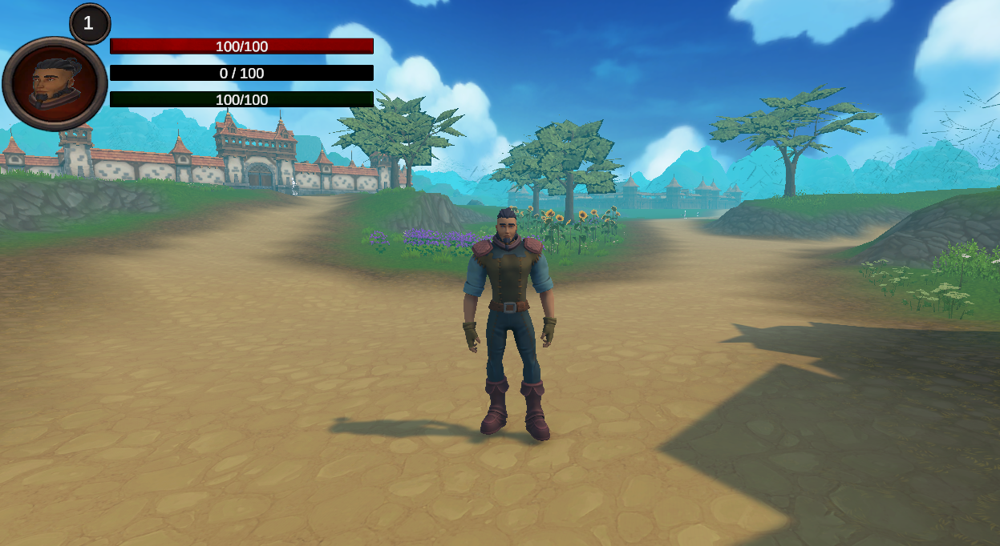

# TWIN STALKER  
*A 3D Action RPG with Dynamic Character Switching and Decision Based System as Innovative Concept for Final year Project*  

  

## 🔥 CORE CONCEPT  
**Twin Stalker** is a Final Year Project developed for the BS in Software Engineering program at University of Mianwali. This innovative action RPG introduces:  

- **Real-time dual-character control** with shared health mechanics  
- **Branching narrative** where choices impact world events  
- **Strategic combat** requiring dynamic switching between melee/ranged fighters  

*Currently in development for potential commercial release.*  

## Gameplay Screenshots
### Main Menu
*The main screen of game allowing user to Start game, Load game, Options Menu and Quit Game*

  

### Tutorial Screen
*After a few seconds, control instructions appear to guide new players through basic movement and combat mechanics*

  

### Switching Mechanic
*The green color bar fills over time and when gauge is filled to 100% user can switch to player named Eric from Eriss*

*Gauge is filled. Press R to switch player Eriss to Eric, resetting gauge to zero*

### Health Mechanic
*The red color bar represents player health which is shared between both players and it decreases when attacked by enemy*

*Health regenerates over time showing effect/VFX*

### XP Mechanism
*The orange/brown XP gauge increases when player kills enemy. Enemy death grants certain points*

*When gauge is completely filled, player level increases along with total health and damage. XP bar resets with increased filling value*

### Decision Based System
*Player interacts with NPC to trigger dialogue. The dialogue system allows player to select choices through which story would progress differently*

*If user selected player named Eriss, it would trigger portal to open. If active player is Eric, user cannot interact with portal*

*If active player is Eriss, player can interact with the portal*

*When player interacts with portal using required active character, the map changes and story progresses further*

### Save Menu
*Players can save their progress anytime by accessing the save menu during gameplay*

### Pause Menu
*Pressing ESC pauses the game, bringing up options to resume, adjust settings, or return to main menu*

### Game Over Screen
*When player health reaches zero, the game over screen appears showing stats and retry options*

---

## 📧 Contact  
- **Email**: muhammad.hasnain.khanzx@gmail.com  
- **LinkedIn**: [Muhammad Hasnain Khan](https://www.linkedin.com/in/muhammad-hasnain-khan-b91aab370)
